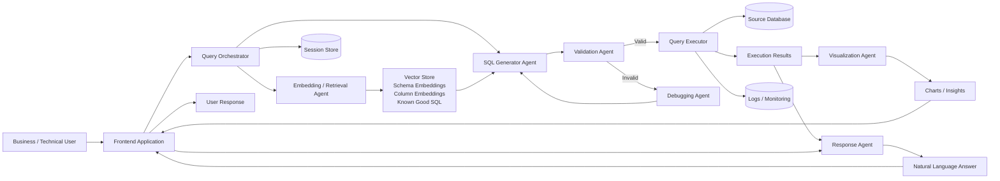

# DataCopilot

DataCopilot is an AI-powered data intelligence assistant that helps users interact with enterprise data using natural language. It translates business questions into SQL, validates and debugs queries, executes them on connected data sources, and returns both concise insights and visualizations.

## Overview

Modern business users often depend on analysts or SQL experts to answer data questions. DataCopilot reduces that bottleneck by enabling a conversational analytics experience where users can ask questions in plain English and receive:

- Generated SQL queries
- Query validation and correction
- Executed results from connected databases
- Natural-language explanations
- Recommended charts and visual summaries

This project was inspired by modular text-to-SQL and agentic analytics systems, and extends that idea into a practical, production-oriented data assistant.

## Key Features

- Natural language to SQL generation
- Retrieval-augmented context using schema and metadata embeddings
- SQL validation before execution
- Debugging and iterative query correction
- Natural-language answer generation from SQL output
- Chart recommendation and visualization generation
- Session-aware conversational workflow
- Logging for traceability and improvement
- Extensible multi-agent architecture

## Architecture

DataCopilot follows an agent-based architecture where each component is responsible for a specific stage in the analytics workflow:

1. The user submits a business question through the frontend.
2. The retrieval layer fetches relevant table metadata, schema context, and known-good SQL examples.
3. The SQL Generator Agent produces a candidate SQL query.
4. The Validation Agent checks syntax and semantic correctness.
5. The Debugging Agent fixes failed or low-confidence queries.
6. The query is executed against the source database.
7. The Response Agent converts results into a business-friendly explanation.
8. The Visualization Agent recommends suitable charts for the result set.
9. Logs and session context are stored for future follow-up queries and observability.

## Architecture Diagram



## Tech Stack

### Frontend
- Streamlit / React / Next.js *(update based on your implementation)*

### Backend
- Python
- FastAPI / Flask *(update as needed)*

### AI / LLM Layer
- OpenAI / Azure OpenAI / Gemini / Anthropic *(choose what you actually used)*
- LangChain / LangGraph / custom orchestration

### Data Layer
- PostgreSQL / BigQuery / MySQL / SQL Server *(choose actual DBs)*
- Vector database for schema and SQL retrieval

### Observability
- Logging database
- Query traces
- Session memory

## Workflow

### 1. User Question
A user asks a business question such as:
> “Show me the top suppliers in West Africa with emission reduction commitments.”

### 2. Context Retrieval
The system retrieves relevant schema information, similar SQL examples, and metadata from the vector store.

### 3. SQL Generation
The SQL generation agent creates a candidate query using the user prompt and retrieved context.

### 4. Validation and Debugging
The generated SQL is validated. If it fails or looks unreliable, the debugging agent iteratively refines it.

### 5. Query Execution
The approved SQL runs on the target data source.

### 6. Response Generation
The result is summarized in natural language so business users can understand it quickly.

### 7. Visualization
When appropriate, charts are suggested or generated automatically to make the output more intuitive.

## Repository Structure

```bash
datacopilot/
│── app/                     # Frontend or application entrypoints
│── backend/                 # APIs, orchestration, services
│── agents/                  # SQL, validation, debugging, response, visualization agents
│── retrieval/               # Embeddings, vector search, schema context
│── database/                # DB connectors, query execution, models
│── prompts/                 # Prompt templates
│── utils/                   # Shared utilities
│── logs/                    # Logs or observability assets
│── notebooks/               # Experiments / evaluations
│── assets/                  # Images, GIFs, diagrams
│── README.md
│── requirements.txt
│── .env.example
```

## Getting Started

### Prerequisites

- Python 3.10+
- Access to an LLM provider
- Access to a supported relational database
- API keys and environment configuration

### Installation

```bash
git clone https://github.com/Bhanubathini2002/datacopilot.git
cd datacopilot
python -m venv .venv
source .venv/bin/activate   # On Windows: .venv\Scripts\activate
pip install -r requirements.txt
```

### Environment Setup

Create a `.env` file:

```env
LLM_API_KEY=your_api_key
DB_HOST=your_host
DB_PORT=your_port
DB_NAME=your_database
DB_USER=your_username
DB_PASSWORD=your_password
VECTOR_DB_URL=your_vector_db_url
```

### Run the Project

```bash
python app.py
```

_or_

```bash
streamlit run app.py
```

_update this section to match your actual entry point._

## Example Use Cases

- Business intelligence Q&A
- Self-service analytics
- Natural language reporting
- SQL assistant for analysts
- Executive dashboard copilots
- Data exploration for non-technical stakeholders

## Challenges Solved

- Reduces dependency on manual SQL writing
- Makes structured data more accessible to business users
- Improves query accuracy with retrieval and validation
- Handles failed SQL using iterative debugging
- Produces both textual and visual insights from one workflow

## Future Improvements

- Role-based access control
- Query cost estimation
- Semantic layer integration
- Dashboard export
- Multi-database federation
- Feedback loop for continuous prompt and SQL improvement
- Evaluation benchmarks for text-to-SQL quality
